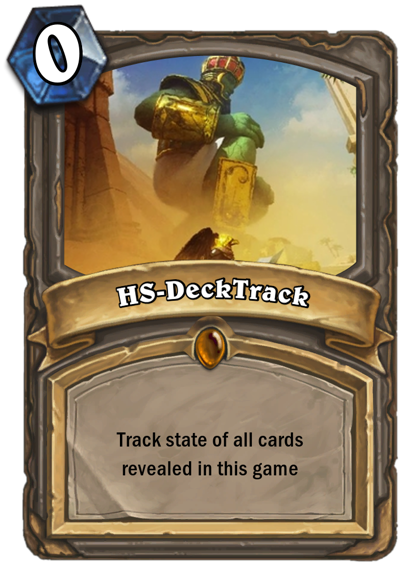

<p align=center></p>

HS-DeckTrack
============

A Terminal-based Deck Tracker for Hearthstone on MacOS

Inspired by [this Reddit thread](http://www.reddit.com/r/hearthstone/comments/26seey/automatic_deck_tracker_and_more_with_ingame/)  
Original credit for the logging tips from: [Flipperbw](http://www.reddit.com/r/hearthstone/comments/268fkk/simple_hearthstone_logging_see_your_complete_play/)

I've thrown this together as a quick hack for those of us who play on MacOS.
Of course, if you're just a Terminal junky, it's Perl, so you can run it wherever you like!

If you have the screen real-estate, just keep the Terminal window visible on one side of the Hearthstone app.  
Users have reported that MacOS app 'Afloat' works well to float this over your HS with transparency.

Requirements
------------
All you really need is the perl script 'HS-DeckTrack' and a deck file, but you can clone the whole project if you like.  

Your log.config must have [Zone] and [Bob] console printing enabled. See examples/log.config or copy it to ~/Library/Preferences/Blizzard/Hearthstone/log.config

Decks
-----
Decks can be specified in a file, or with a Hearthpwn URL.  
If creating a file yourself, it's just a simple text file with the (case sensitive) card names and an optional card count (before or after!).  
See a couple of samples in the examples/ directory. Cards with multiples must be entered multiple times.  
Card order is not important.  
  
e.g. This is totally valid in the same file for 2 of each of these cards:  
Soulfire  
Soulfire  
Argent Squire x2  
Doomguard x 1  
1 Doomguard  
1x Mortal Coil  
Mortal Coil  
Voidwalker 2  

CLI Usage
---------
Simply copy HS-DeckTrack, make it executable (`chmod +x /path/to/HS-DeckTrack`) and run it in a Terminal window. If you run with `-h`, basic help will be printed to get you going.  
Screen will refresh every 2 seconds showing the curent state of your latest game.  
As soon as a game ends, the game state will reset to a new full deck. 
The script can be started mid-game and will still have the current state (thanks to the fact the we are just parsing the logs).  
  
The script can now be found in `HS-DeckTrack.app/Contents/Resources/Scripts/HS-DeckTrack` if you still want to CLI it.  

.app Usage
----------
I've bundled the script in an AppleScript App bundle that can now be launched from the Finder!!  
Double-click 'HS-DeckTrack.app', you'll be prompted for a Hearthpwn URL or to select a local file.  


CLI Example
-----------
```
Bru7us:HS-DeckTrack bru7us$ ./HS-DeckTrack -d examples/zoo.deck 
    
Cards in Deck:

 0  | Soulfire                 2
 1  | Abusive Sergeant         1
 1  | Argent Squire            2
 1  | Flame Imp                2
 1  | Mortal Coil              2
 1  | Power Overwhelming       2
 1  | Shieldbearer             1
 1  | Voidwalker               2
 2  | Dire Wolf Alpha          2
 2  | Ironbeak Owl             1
 2  | Knife Juggler            2
 3  | Arcane Golem             1
 3  | Shattered Sun Cleric     1
 4  | Dark Iron Dwarf          2
 4  | Defender of Argus        2
 4  | Hellfire                 1
 5  | Doomguard                1
 6  | Argent Commander         1
     
    
 Cards Played:
```

Change Log
----------

Version: 0.4  Released: xx June 2014
* #UPDATEME#

Version: 0.3  Released: 21 June 2014

* Tracking of Opponent Secrets (Friendly already worked as regular card plays)
* Get mana cost of cards from local Hearthstone data and cache it
* Disply mana cost if we can get it from the local cache
* Allow tracking of revealed cards without a deck file
* Some code tidy-up

Version: 0.2  Released: 19 June 2014

* Correctly track burned and discarded cards

Version: 0.1  Released: 18 June 2014

* Initial release

TODO
----
* Optional: Display cards in hand (but why? we can see them already)
* Check for and set up the log.config if needed


If you'd like to:
[](https://www.paypal.com/cgi-bin/webscr?cmd=_donations&business=W3UX3VM22WRQY&item_name=HS-DeckTrack)

